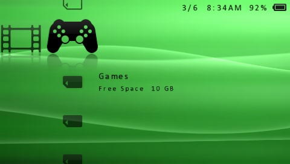
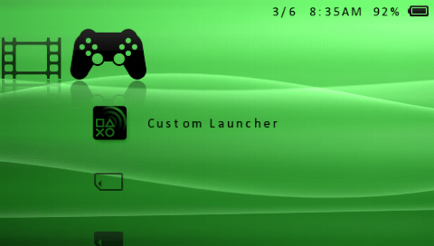

# XMB Item Hider PSP

XMB Item Hider (aka XrossMediaBar™ Item Hider) is a PSP plugin that hides XMB menu items — and now **entire XMB categories**, not just the items inside them.

Continuation of Frostegater's project: https://www.gamebrew.org/wiki/XMB_Item_Hider_PSP

**Highlights of this fork:**
- **Hide the Network & PlayStation®Network categories** — remove the two largely unused columns entirely.
- **Relocate ARK's CFW "Extras" items** into the categories they belong in.
- **Start the XMB on Memory Stick** instead of UMD / Saved Data Utility.

Tested on:
- ARK-4 (PSP 1000, PSP 3000)
- ARK-5 (PSP 2000)

**If you use category_lite.prx, you must update it to [this new version](https://github.com/Exceen/game-categories-lite/blob/main/release/category_lite.prx) — it's required for these features to work correctly.**

## Bonus Features

Each item in `xmbih.ini` takes a value: **`0`** = show, **`1`** = hide that item, and (for `HIDE_ALL_*` entries under `[Global]`) **`2`** = hide the entire category.

#### <ins>Hide the Network & PlayStation®Network categories:</ins>
The two rightmost columns are largely unused. Hide them completely under `[Global]`:
```
HIDE_ALL_NETWORK = 2
HIDE_ALL_PSN = 2
```
Because they sit at the right edge of the XMB, hiding them is safe — unlike categories to the left of `Game` (see [**Known Bugs/Limitations**](#known-bugslimitations)).



#### <ins>Relocate ARK's "Extras" items:</ins>
On ARK CFW, the `Extras` category holds three injected items: **Custom Firmware Settings**, **Plugins Manager**, and **Custom Launcher**. Set `MOVE_ARK_EXTRAS = 1` under `[Global]` and set your **VSH region** to **`Russia`** or **`Debug I`** (other Extras-less regions also work: `Latin America` / `Hong Kong` / `Taiwan` / `China`) and you will get this result:

- **Custom Launcher** → Game category
- **Custom Firmware Settings & Plugins Manager → end of `Settings`** (with corrected Settings-column icons)



`HIDE_ALL_EXTRAS = 2` can be used as well instead of setting a VSH region, but keep in mind that there are some bugs (see [**Known Bugs/Limitations**](#known-bugslimitations)).

#### <ins>Start the XMB on Memory Stick:</ins>
Set `START_AT_MEMORY_STICK = 1` under `[Global]` to boot with the cursor on **Memory Stick** in the `Game` category instead of `UMD` / `Saved Data Utility`. Also works with [category_lite.prx](https://github.com/Exceen/game-categories-lite/blob/main/release/category_lite.prx).

- This **force-hides the "UMD Update" item** (equivalent to setting `UMD_UPDATE = 1`) to prevent crashes when booting/resetting the VSH with a UMD inserted.

## Installation:
1\. Download the [`.prx`-file](https://github.com/Exceen/XMB-Item-Hider-PSP/raw/main/release/xmbih.prx) and the [`.ini`-file](https://github.com/Exceen/XMB-Item-Hider-PSP/raw/main/release/xmbih.ini)<br>

2\. Move both `.prx` and `.ini` into your `SEPLUGINS` folder and enable the plugin.<br>

3\. Open the `.ini` in a text editor and set your options: `1` hides an individual menu item, and `2` (on `HIDE_ALL_*` entries) hides an entire category. See [**Bonus Features**](#bonus-features) above for the flagship options. Note that the `.ini`-file is already pre-configured with the bonus features.<br>

4\. Boot your PSP / Reset the VSH (XMB).

## Known Bugs/Limitations:
- Completely hiding any category to the left of the `Game` category can cause buggy behavior with `Game` menu items. (e.g. duplicated Memory Stick entries; crashes with a UMD inserted; crashes when waking from sleep; deleted Resume Game entries not disappearing until the next full VSH reset)
  - If you want to hide only the `Extras` category then you can just use another VSH region like: `Latin America` `Hong Kong` `Taiwan` `Russia` `China` `Debug I`